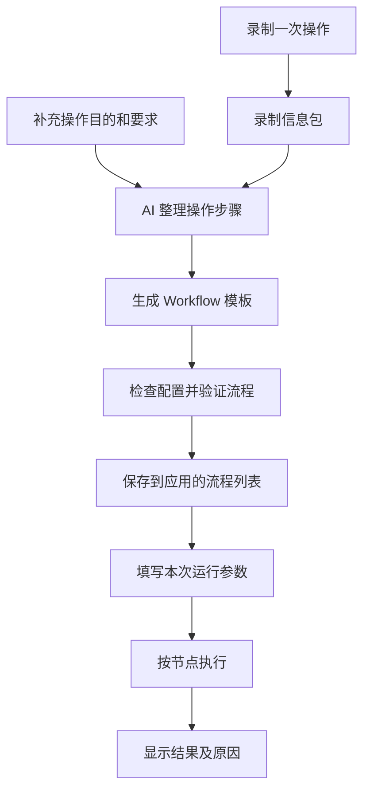
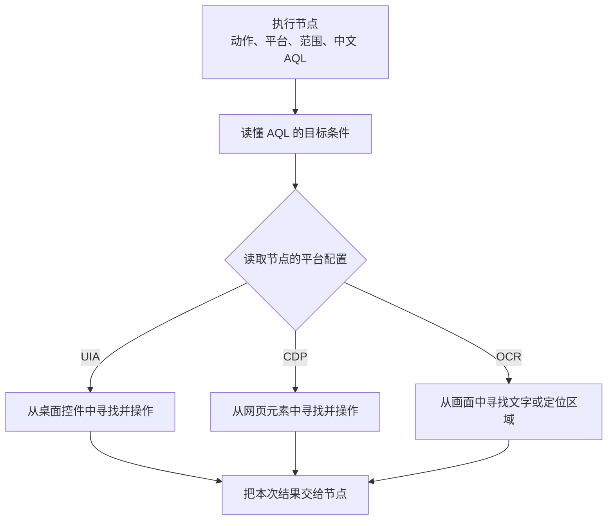
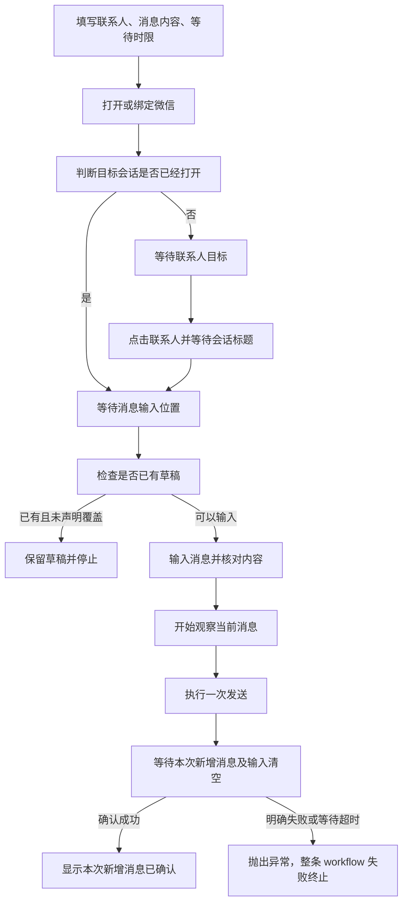

# ArgusFlow：从操作录制到通用 Workflow

> 本文说明目标设计，供后续实现使用。文中的中文 AQL 和节点配置是设计示例，不能直接当成当前代码已经支持的格式。
>
> 核心约定：**节点决定做什么、使用哪个平台；节点里的中文 AQL 描述要找什么目标。录制器提供事实，AI 把这些事实整理成可以反复运行的流程。**

## 1. 用户最终会怎么用

你先录制一次操作，再告诉 AI 这段操作的目的。AI 根据录制信息生成流程模板。以后运行时，你只填写这次要用的参数。

**例如：** 你演示“打开微信，给文件传输助手发送你好”，并说明“联系人和消息内容每次都可以修改”。AI 就生成“向指定联系人发送消息”模板。下次填写联系人和消息，即可运行同一份模板。



AI 主要负责生成和修改模板。正常运行时，程序按照模板执行，不需要每一步都让 AI 临时决定点哪里。

**例如：** 模板已经规定“等联系人出现，再点击联系人”，执行器就按这个规则运行。页面改版导致找不到目标时，可以把这次记录交给 AI 修改模板。

## 2. 节点、平台和 AQL 分别负责什么

一个节点是流程中的一步。AQL 是这个节点里用于描述目标的配置，不是单独的一类流程节点。

| 内容 | 负责什么 | 例如 |
| --- | --- | --- |
| 节点类型 | 这一步做什么 | 等待目标、点击目标、输入文本 |
| 平台 | 这一步通过什么方式识别和操作 | UIA、CDP、OCR |
| 作用范围 | 在哪个应用、窗口、页面或区域中找 | 微信主窗口的会话列表 |
| 中文 AQL | 要找什么目标 | 文本为“文件传输助手”的目标 |
| 输入参数 | 这一次操作使用什么值 | 联系人、消息内容 |
| 节点超时 | 这个节点最多等待多久 | 最多等 10 秒；超时直接抛出异常，整条 workflow 失败终止 |

这里的“平台”指自动化方式：UIA 读取桌面控件，CDP 读取浏览器页面，OCR 识别画面文字。它不是 Windows、macOS 这样的操作系统分类。

**例如：** “点击目标”节点可以配置平台为 UIA，也可以配置为 OCR。节点的动作仍然是点击，AQL 仍然用中文描述同一个目标。

### 2.1 一个节点长什么样

下面是便于阅读的设计示例，字段名称也用中文表达；后续实现可以确定正式保存格式。

```json
{
  "名称": "等待联系人出现",
  "节点类型": "等待目标",
  "平台": "OCR",
  "作用范围": { "应用": "微信", "窗口": "主窗口", "区域": "会话列表" },
  "AQL": "目标(文本=$联系人)",
  "AQL参数": { "联系人": { "来自": "运行参数", "名称": "联系人" } },
  "等待条件": "存在",
  "最长等待毫秒": { "来自": "运行参数", "名称": "等待时限" }
}
```

“会话列表”这样的区域名称，需要在模板中给出定位规则，不能只写一个名字就假设程序知道位置。“主窗口”也应有明确的选择条件。

**例如：** 模板可以把“搜索框下方、聊天内容左侧的区域”定义为会话列表。窗口移动后，程序重新找到这个区域，不继续使用录制时的绝对坐标。

### 2.2 平台在节点中配置，AQL 不写平台



这张图展示节点内部的处理过程。用户不需要在 Workflow 中额外摆出“AQL 解析”“平台映射”等节点。

**例如：** 两个点击节点都使用 `目标(文本="发送")`。一个配置 UIA，另一个配置 CDP，程序分别找到桌面控件和网页元素，并执行对应操作。AQL 中不出现 UIA、CDP、OCR 或它们的专有字段。

## 3. 录制器如何把平台信息交给 AI

录制器在每次操作附近，记录它实际获取到了什么信息。AI 根据这些证据填写节点的平台，而不是靠应用名称猜测。

| 录制信息 | AI 用来判断什么 | 例如 |
| --- | --- | --- |
| 进程和窗口 | 操作发生在哪个应用里 | 点击属于微信主窗口 |
| 鼠标、键盘操作 | 用户实际做了什么 | 单击、输入、按 Enter |
| UIA 信息 | 有没有可用的桌面控件信息 | 命中的控件名称为“发送” |
| CDP 信息 | 有没有可用的网页元素信息 | 命中了页面中的提交按钮 |
| 截图和 OCR | 画面里有什么文字和位置 | 点在“文件传输助手”的文字框内 |
| 操作前后变化 | 操作之后出现了什么结果 | 会话标题改变、输入框清空 |
| 用户说明 | 哪些是目的、参数或完成要求 | 联系人每次运行时填写 |

一次操作可能同时有 UIA 和 OCR 信息。录制器都可以保留，但要说明获取是否成功、是否过期、是否能关联到这次点击。

**例如：** UIA 调用成功，却只读到整个窗口，没有读到实际点击的联系人。OCR 则识别到了联系人文字。AI 应据此选择 OCR，而不能因为“UIA 调用成功”就认定 UIA 已经定位到目标。

一个节点选定平台后，运行时按该配置执行。平台不可用时应说明原因。需要换平台时，应明确调整节点配置并重新验证，不能在用户不知道的情况下换一种查找含义。

**例如：** 浏览器连接断开，应显示“无法连接此页面，流程已停在点击按钮这一步”，而不是偷偷改用桌面坐标点击。

## 4. 中文 AQL 如何设计

### 4.1 用中文写规则，用确定的语法执行

AQL 使用中文名称、条件和空间关系。它需要有固定写法，让程序能够准确解释。用户可以用日常中文描述需求，再由 AI 或编辑器转成正式 AQL。

**例如：** 用户说“点搜索框右边第二个设置”。AI 转成一条包含锚点、方向、目标文本和顺序的 AQL，程序不需要在每次运行时重新猜这句话的意思。

下面的写法都是建议语法：

```text
目标(文本="发送")
目标(文本=$联系人)
目标(文本包含="订单")
按钮(文本="保存", 可用=是)
输入框(名称="消息")
```

带有 `$联系人` 的部分是参数，运行时再填入值。中文规则和实际文字分开保存。

**例如：** 联系人叫“张三的工作群”，程序把整段文字作为参数值使用。即使名字里有引号，也不会把查询拆成另一种规则。

### 4.2 不同平台如何理解同一个目标

平台负责把自己获取的信息转换成 AQL 能理解的目标条件，再把动作映射到对应的操作方式。

| 中文条件 | 统一含义 |
| --- | --- |
| 文本 | 用户在目标上能读到的文字 |
| 名称 | 目标的说明或标签，不保证画面上直接显示 |
| 当前值 | 输入框等目标当前保存的内容 |
| 类型 | 已确认的按钮、输入框、文字等类别 |
| 可见 | 来源能够确认目标在当前查看范围内 |
| 可用 | 来源能够确认目标允许操作 |

这些条件的含义要保持一致。平台不能为了“查得到”，随意把隐藏属性当成画面文字，也不能把缺少的信息当成“否”。

**例如：** OCR 看到了“发送”两个字，可以满足 `目标(文本="发送")`。但如果没有额外识别能力，就不能仅凭这两个字证明它是一个“可用的按钮”。

平台读取或识别不出所需条件时，节点明确报告原因。统一 AQL 的价值是让目标描述保持一致，并不是让各个平台凭空拥有相同能力。

**例如：** “OCR 暂时无法判断这个输入框是否可编辑。请调整目标条件或节点的平台配置。”

没有文字的目标可以用已确认的控件信息，或明确的锚点相对区域来定位。区域是规则推导出来的位置，不代表 OCR 自动识别出了输入框类型。

**例如：** 空白消息编辑区没有文字，可以先找到工具栏，再定位它上方的指定区域；点击后还要检查焦点，不能只凭位置就开始输入。

平台特有的连接信息、识别设置和必要的定位补充，放在节点的平台配置中，不进入 AQL。

**例如：** OCR 使用哪个模型，CDP 连接哪个页面，都属于平台配置。中文 AQL 仍然只写“寻找什么目标”。

### 4.3 找不到和找到多个，要分开处理

查找范围、数量要求和顺序必须明确。默认点击要求只有一个目标；出现多个时，不能随便取第一个。

**例如：** 页面里有三个“删除”，其中两个属于其他订单。应增加订单范围或空间关系，而不是碰运气点击。

AQL 可以明确选择“最左上角”“最右侧”或“最近的第 2 个”。排序方法不同，结果可能不同，编辑器应让用户看见当前使用哪一种。

**例如：** “第二个发送”按从上到下排序，与“离消息输入框第二近的发送”不是同一个目标。“最左上角”约定为先选位置最靠上的目标，高度相同时再选最靠左的目标。

## 5. 空间查询：八方向、角度和距离

空间查询按同一顺序执行：**确定范围 → 找到锚点 → 筛选目标 → 限定方向或角度 → 限定距离与对齐 → 排序 → 选择第几个。**

这里的“锚点”就是用来判断方位的参照物。

**例如：** “找搜索右侧的文件传输助手”中，“搜索”是锚点，“文件传输助手”是目标。

### 5.1 支持八个方向

采用屏幕上直观可见的方向：上、下、左、右、上左、上右、下右、下左。方向词本身对应一段角度，避免“右侧”和“上右侧”没有明确边界。

建议规定：以锚点中心为起点，向右是 0°，向上是 90°，向左是 180°，向下是 270°。角度沿逆时针增加。

| 方向 | 中心角度 | 默认角度范围 |
| --- | --- | --- |
| 右 | 0° | 337.5°～22.5°，跨过 0° |
| 上右 | 45° | 22.5°～67.5° |
| 上 | 90° | 67.5°～112.5° |
| 上左 | 135° | 112.5°～157.5° |
| 左 | 180° | 157.5°～202.5° |
| 下左 | 225° | 202.5°～247.5° |
| 下 | 270° | 247.5°～292.5° |
| 下右 | 315° | 292.5°～337.5° |

每个范围包含起点、不包含终点，同一个边界不会同时落入两个方向。

**例如：** 目标与锚点的连线为 45°，属于“上右”；恰好为 67.5°，属于“上”。如果用户希望右侧包含更大的范围，可以直接指定角度区间。

```text
空间查找(
  锚点=目标(文本="搜索", 选择=最左上角),
  目标=目标(文本=$联系人),
  方向=右,
  排序=距离从近到远,
  选择=第1个
)
```

**例如：** 先找到最左上角的“搜索”，再从右方扇形范围中寻找联系人，最后选择最近的一个。

### 5.2 直接指定角度区间

方向和角度区间是两种选择，不能同时填写，以免产生互相矛盾的规则。

```text
空间查找(
  锚点=目标(文本="订单编号"),
  目标=目标(文本="查看详情"),
  角度区间=25度到45度,
  排序=距离从近到远,
  选择=第1个
)
```

**例如：** 只在“订单编号”的右上方 25°～45°扇形内找“查看详情”。20°的目标被排除，30°的目标参与比较；距离最近但不在角度区间内的目标也不能入选。

角度区间沿逆时针从起点走到终点，仍然包含起点、不包含终点。允许跨过 0°。

**例如：** “350度到10度”表示正右方附近的小扇形。起点和终点相同应提示重新填写；如果需要所有方向，直接写“任意方向”。

### 5.3 明确“最近”按什么计算

建议默认按两个目标中心之间的直线距离排序。需要考虑大按钮或大区域时，可以明确改成“边缘距离”，即两个外框之间的最短距离。

**例如：** 一个很宽的按钮边缘紧贴锚点，但中心较远。按中心距离，它可能排第二；按边缘距离，它可能排第一。AQL 应把选择写清楚。

距离可以用逻辑像素，也可以用当前查找范围短边的百分比。逻辑像素是用于适配显示缩放的统一长度；平台负责转换，无法可靠转换时应报告问题。

```text
空间查找(
  锚点=目标(文本="姓名"),
  目标=输入框(),
  方向=右,
  距离依据=边缘距离,
  最大距离=范围短边的30%,
  排序=距离从近到远,
  选择=第2个
)
```

**例如：** 先排除太远的输入框，再在剩下的候选中选第二近的一个。如果范围内只有一个，应报告“没有第 2 个匹配目标”，不能改选第 1 个。

### 5.4 限定同一行、同一列和查找区域

方向只说明大致位置。可以再加“同一行”“同一列”，排除旁边其他区域的同名文字。

**例如：** 要点订单 A 右侧的“删除”，可以同时要求“在订单 A 所在行内”。这样下一行订单 B 的“删除”不会被选中。

```text
空间查找(
  范围=区域(名称="订单列表"),
  锚点=目标(文本=$订单编号),
  目标=目标(文本="删除"),
  方向=右,
  对齐=同一行,
  对齐容差=范围高度的2%,
  排序=距离从近到远,
  选择=第1个
)
```

“同一行”可按中心高度差判断，“同一列”按中心横向差判断。容差允许轻微错位。区域名称需要有定义；若该行只能通过结构关系识别，平台必须确实提供该关系。

**例如：** 标签比按钮高 3 个逻辑像素，仍可视为同一行。偏到下一行超过允许差值，就会被排除。

### 5.5 进一步组合，仍然保持可解释

| 能力 | 用途 | 例如 |
| --- | --- | --- |
| 距离下限和上限 | 找指定距离带内的目标 | 只找距离锚点 20～120 逻辑像素的“编辑” |
| 区域内、区域外 | 限制业务范围 | 只找弹窗内的“确定”，排除页面底部的“确定” |
| 两个锚点之间 | 限制夹在中间的区域 | 找“起始日期”和“结束日期”之间的输入框 |
| 排除重叠目标 | 避免选到盖在锚点上的对象 | 只找真正位于右侧且不与锚点重叠的按钮 |
| 多次空间查找 | 逐步缩小范围 | 先找订单，再找它右侧的菜单，再找菜单下方的“取消” |
| 位置排序 | 不按距离选目标 | 在当前区域内选择从上到下第 3 个“下载” |

“两个锚点之间”也要定义清楚：建议默认表示连接两个锚点中心的线段附近，并允许设置带宽；若需要两点围成的矩形区域，应明确选择矩形模式。

**例如：** 两个锚点斜着排列时，“在线段附近”不会把整个包围矩形里的其他对象都选进来。

锚点有多个时，也需要先消除歧义。完全重合的中心没有方向；两个候选同样近时，可以追加位置排序，仍无法区分就停下说明原因。

**例如：** 窗口里有两个“搜索”，AQL 应写“会话列表内最左上角的搜索”，再开始找它右侧的联系人。

### 5.6 不同平台，空间规则必须一致

平台先提供目标边界，再由同一套空间规则计算方向和距离。坐标必须属于同一个已确认的窗口或页面范围，并使用一致、横纵等比例的单位。

**例如：** 浏览器坐标和屏幕坐标不能直接相减。也不能把横坐标除以窗口宽度、纵坐标除以窗口高度后就计算角度，否则长窗口里的角度会失真。

切换节点平台后，AQL 中“25度到45度”的含义不变。平台拿不到可靠位置时，应该说明无法执行空间条件，不应给出猜测坐标。

## 6. Workflow 参数：运行时填写什么

### 6.1 固定规则与每次填写的值分开

| 内容 | 放在哪里 | 例如 |
| --- | --- | --- |
| 动作、平台、中文 AQL | 模板的节点配置 | 点击联系人，使用 OCR |
| 每次可能不同的业务值 | 运行参数 | 联系人、消息、订单号 |
| 上一步得到的内容 | 节点输出 | 读取到的订单编号 |
| 本次连接到的实际应用 | 运行中的应用连接 | 这次打开的微信窗口 |
| 当前步骤临时使用的值 | 流程内的临时变量 | 正在处理第几条订单 |

**例如：** “向哪个联系人发送”每次填写，但“从会话列表找联系人”的规则保存到模板中。录制时的窗口编号不用用户填写。

### 6.2 每个参数都要说明用途

| 参数名 | 类型 | 默认值 | 检查规则 | 界面说明 |
| --- | --- | --- | --- | --- |
| 联系人 | 文本 | 不设置 | 必填，不能全是空格 | 输入要打开的联系人名称 |
| 消息内容 | 文本 | 不设置 | 必填；是否允许换行由模板说明 | 输入本次要发送的内容 |
| 等待时限 | 整数，单位毫秒 | 10000 | 建议此模板限定为 1000～60000 | 最多等待目标出现多久 |
| 附件路径 | 可选文本 | 无 | 填写后检查文件是否可用 | 不发附件时留空 |

这些限制是模板选择，不是对所有程序统一规定。

**例如：** 输入框只允许单行文字的应用，应在运行前提示“消息内容不能换行”，而不是输入一半后才失败。

还可以使用开关、列表和包含多个字段的记录。

**例如：** 批量发送可以接收一组“联系人＋消息内容”，每次循环取一组。是否允许连续发送、每次如何确认，由流程明确规定。

### 6.3 参数如何进入节点

节点应清楚标出一个值来自“固定填写”“运行参数”还是“前一步结果”。

| 节点配置 | 本例的值 |
| --- | --- |
| 节点类型与平台 | 点击目标；OCR |
| 查找范围 | 微信主窗口的会话列表 |
| AQL | `目标(文本=$联系人)` |
| 参数来源 | `$联系人` 使用本次运行填写的“联系人” |

**例如：** 本次联系人填“文件传输助手”，这个值同时用于点击联系人和检查会话标题。下次换成其他联系人，两个节点一起使用新值。

运行开始前统一检查参数。界面手动运行和其他流程调用都经过同样的检查。一次运行开始后，输入参数保持不变；需要修改时开始新一次运行。

**例如：** 流程正在给张三发送时，用户编辑参数表单，不会让后半段突然改成给李四发送。

默认值只在没有提供值时使用，不把数字 0、开关“否”或空字符串偷偷替换成默认值。哪些空值允许存在，由参数规则说明。

**例如：** “是否发送附件”填写“否”，必须保留“否”，不能因为它不是“是”就套用默认设置。

### 6.4 等待时限也可以来自运行参数

整条流程不设置超时时间，也没有全局截止时间。需要限制等待时长时，由具体节点设置；节点可以引用运行参数中的等待时限。需要在实现中增加相应支持，不能直接假设当前静态超时字段已经接受参数表达式。

**例如：** 无论流程已经运行了多久，进入“等待联系人出现”节点后，都可以按本次配置最多等待 10 秒。该节点等待期间，重新截图不会重置计时；后续节点按自己的等待配置执行，不共用整条流程的时间额度。

节点超时就像代码执行 `throw`：抛出超时异常并向上传播，整条 workflow 立即失败终止，不执行后续业务节点，也不自动重试或转入恢复分支。子流程中的超时同样向上传播，使调用它的 workflow 失败。结束时仍需释放本次运行占用的监听、连接和操作锁；清理资源不代表流程继续执行。

**例如：** “等待联系人出现”配置为 10 秒，10 秒内没有出现就抛出异常，记录节点名称、等待目标和实际等待时长。后面的点击、输入和发送全部不执行。

## 7. 流程需要哪些通用节点

| 节点类型 | 作用 | 例如 |
| --- | --- | --- |
| 打开或绑定应用 | 找到本次要操作的应用 | 按配置唤起微信 |
| 等待目标 | 等到目标满足条件 | 等待联系人出现 |
| 判断目标 | 检查当前状态并输出结果 | 判断目标会话是否已打开 |
| 点击目标 | 找到目标并点击 | 点击匹配的联系人 |
| 输入文本 | 找到输入位置并输入 | 输入本次消息内容 |
| 读取内容 | 读取目标的文字或当前值 | 读取订单号 |
| 按键、滚动、拖动 | 执行明确的交互 | 在已确认的输入位置按 Enter |
| 开始观察 | 在动作前记录当前状态 | 记录当前已经显示的消息 |
| 等待变化 | 等待相对之前的新结果 | 等待本次新增消息 |
| 条件分支与循环 | 根据结果决定接下来做什么 | 已打开就跳过点击 |
| 调用流程 | 复用另一份模板 | 在日报流程中调用发送消息流程 |

需要定位目标的节点，都在自身配置中填写平台、范围和中文 AQL。纯控制节点不需要强行填写 AQL。开始观察和等待变化要使用同一平台和同一观察范围。

**例如：** “条件分支”只消费前一步“会话是否打开”的结果，不需要自己再连 UIA。按键节点则必须确认作用窗口和输入焦点，不能向不明确的“当前窗口”盲发按键。

输入方式需要明确区分“追加”“替换”“在当前选区输入”。

**例如：** 输入框已有用户草稿时，流程不能默认全选覆盖。模板未声明处理方式，就保留草稿并停止。

## 8. 等待目标与等待本次变化

### 8.1 “存在”与“新出现”是两种条件

| 条件 | 什么时候满足 | 例如 |
| --- | --- | --- |
| 存在 | 现在能找到目标 | 会话标题已经显示，也算满足 |
| 不存在 | 在有效且覆盖完整的范围内确认没有目标 | 加载提示已经消失 |
| 唯一 | 只找到一个匹配目标 | 只有一个可点击的“确认” |
| 稳定 | 同一目标在一段时间内保持指定状态 | 按钮位置稳定后再点击 |
| 新出现 | 相比动作前，多了一个新目标 | 本次新增消息 |
| 内容改变 | 原来的目标出现期望的新值 | 保存状态从“未保存”变成“已保存” |

**例如：** 聊天里原本就有“你好”，等待“你好存在”会立刻结束。但等待“本次新增的你好”必须结合动作前后的观察。

读取失败不等于目标不存在。

**例如：** 页面连接断开后返回空结果，不能据此判断“加载提示已经消失，可以继续点击”。

### 8.2 先观察，再动作，再判断变化

正确顺序是：开始观察并确认已就绪 → 执行动作 → 等待变化 → 结束观察。观察过程中持续保留必要变化，不能等点击完才开始收集。

**例如：** 弹窗只出现了半秒。点击前已经开始观察，就有机会记录到；点击后再准备截图，可能已经错过。

对于重复内容，需要跟踪目标是否是新的，不能只比较文字或数量。

**例如：** 屏幕始终显示 7 条“你好”，发送后顶部移走一条、底部进入一条。只有确认了新增过程，才能认定本次出现了新消息。

### 8.3 结果要让用户看得懂

| 结果 | 展示方式 |
| --- | --- |
| 有足够证据 | “已确认本次新增消息。” |
| 观察到明确失败 | “应用提示发送失败，流程已停止。” |
| 等待确认超时 | 抛出超时异常，workflow 失败终止；提示“消息可能已经发送，但无法确认。流程不会自动重发。” |

**例如：** 出现新气泡说明本地界面有了新消息，不等于服务器已经收到。如果用户要求“确认送达”，模板还需要应用提供的送达信息。

## 9. AI 如何把录制变成模板

AI 同时接收：操作记录、各平台实际获取的信息、用户的目的、可用节点说明和中文 AQL 规则。生成流程分成几个清楚的步骤：

| 步骤 | AI 要完成什么 | 例如 |
| --- | --- | --- |
| 整理操作 | 合并连续输入，识别点击、拖动和窗口切换 | 把输入“你好”的过程归为一次编辑 |
| 确定目标 | 结合点击位置和操作前证据生成中文 AQL | 确认点的是联系人，而不是同名聊天内容 |
| 配置平台 | 依据有效的录制证据填写节点平台 | 联系人通过 OCR 获取，网页按钮通过 CDP 获取 |
| 提取参数 | 按用户要求区分固定值与每次填写的值 | 把“你好”提取为消息内容 |
| 补充条件 | 加入等待、判断和完成检查 | 已进入目标会话就不再点击联系人 |
| 生成流程 | 将节点连接起来，填写参数来源 | 点击后等待标题，再输入消息 |
| 检查结果 | 检查语法、参数、平台能力和步骤关系 | 不允许引用一个不存在的运行参数 |

AI 的推断需要与录制事实分开。

**例如：** 录制只演示了“成功打开会话”，没有演示失败后怎么恢复。AI 可以提出恢复步骤，但不能把它标记成已经验证过。

生成后先检查配置，再用录制信息验证定位，最后按需要做真实运行验证。三种检查分别记录结果。

**例如：** AQL 写法正确，只说明程序能读懂；在录制截图中找到了联系人，也不能证明换一个窗口大小后仍能可靠操作。

## 10. 完整例子：发送消息

用户录制并说明：“联系人和内容运行时填写。如果已经在这个会话中，不要再点一次联系人。”



每个相关节点都有自己的平台配置，由录制信息决定；它们的 AQL 都用中文。平台可以不同，但必须明确操作的是同一个应用中的正确目标。

**例如：** “点击联系人”的目标是联系人文字，“判断会话打开”的目标是标题区域中的联系人文字。两处虽然文本一样，也不能用不限定范围的同一条查询代替。

若点击后识别到空白界面，流程可以通过预先设置的正常条件分支执行界面恢复步骤，并限制次数。恢复成功后重新检查会话。这是识别到特定界面状态后的处理，不是超时后的兜底；任何节点一旦超时，整条 workflow 立即失败终止。

**例如：** 允许重新定位联系人并再点击一次，但不允许把“发送结果未确认”的分支连回发送节点。恢复界面和重复发送是不同操作。

## 11. 模板怎样独立运行和修改

模板保存节点、连接关系、中文 AQL、平台配置和参数说明。录制证据单独保留，用来解释或修改模板。运行模板时，不需要再次播放整段录制。

**例如：** “发送消息”可以放在微信的流程列表中，也可以被“发送日报”调用。上层只传联系人和内容，下层返回具体执行结果。

每次运行重新定位应用和目标。旧进程编号、窗口位置、临时对象都不能当成永久地址；也不能在流程结束时随意关闭用户原本打开的应用。

**例如：** 今天微信窗口在左边，明天移到右边，节点仍按范围和 AQL 重新查找，而不是点击昨天的屏幕位置。

修改模板后，新运行使用新版本；正在运行的那一次继续使用启动时的版本。

**例如：** AI 修改了联系人定位规则，不会导致正在发送消息的流程执行到一半突然换规则。

同一桌面的键盘鼠标需要协调使用，不让多个流程同时抢焦点。

**例如：** 一个流程正在微信输入，另一个流程不能同时切到表格并输入。后者应等待可操作时机；若该等待节点配置了超时，超时就抛出异常，终止后者所属的 workflow。

## 12. 后续实现按什么顺序推进

1. 先确定节点的统一配置：动作、平台、范围、中文 AQL、参数来源和等待设置。
2. 实现中文 AQL 的基本查找与参数绑定，让三个平台按同一目标含义执行。
3. 加入八方向、角度区间、距离、对齐和组合空间查询，并提供定位预览。
4. 打通录制信息到 AI，再到模板生成和检查的完整链路。
5. 完善变化观察、运行结果和模板修订，覆盖重复内容、已打开目标、界面空白等场景。

**例如：** 编辑器可以把锚点框出来，画出 25°～45°的查找扇形，并给候选标上距离和排名。用户看到“为什么选了这个目标”，才能方便地调整规则。

验收时重点检查：中文规则是否可读、平台是否配置在节点内、同一空间规则是否跨平台一致、参数是否真正影响运行，以及找不到、找到多个和无法确认时是否给出清楚说明。

**例如：** 提示“找到 3 个‘发送’，请增加查找范围或位置条件”，比只显示“匹配错误”更容易处理。

现有英文查询和相关节点组织，需要按这份目标设计调整。本文只重写设计，不表示底层实现已经完成迁移。
